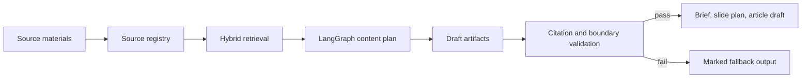

# Source2Content Agent

[](https://github.com/Starry-49/source2content-agent/actions/workflows/tests.yml)

Source2Content Agent is a small portfolio-grade service for turning source materials into traceable content artifacts: a content brief, a slide plan, an article draft, and a source registry.

The project grows out of my existing knowledge-production tools:

- `SynQuest / BioIntro`: source ingestion, hybrid retrieval, question/content generation, and deduplication.
- `Image2Slides`: source-bound content planning and editable output handoff.
- `Codexy-OK / Skill-Auditor`: durable agent workflow, permission boundaries, verifiers, and fallback behavior.

It is intentionally not a one-off JD clone. The main product idea is source-grounded content generation: generated drafts are useful only when their factual claims can be traced back to registered evidence.

## What it builds

For a small set of markdown or text-like sources, the service produces:

- `content_brief.md`: objective, audience, retrieved source angles, and boundary rules.
- `slide_plan.json`: a compact slide-by-slide plan with source ids.
- `article_draft.md`: a source-cited draft for review.
- `source_registry.json`: source ids, titles, kinds, metadata, sizes, and digests.
- `validation_report.json`: citation and boundary check results.

Sample outputs are committed under [`artifacts/sample_run`](artifacts/sample_run).

## Architecture



## Tech stack

- API: `FastAPI`
- Workflow graph: `LangGraph`
- Retrieval: `rank-bm25`, `scikit-learn` TF-IDF, `RapidFuzz`, optional `sentence-transformers`
- Packaging: `Dockerfile` and `docker-compose.yml`
- Tests: `pytest` + FastAPI `TestClient`

`sentence-transformers` is wired as an optional semantic backend. The default local and Docker run uses `SOURCE2CONTENT_SEMANTIC_MODEL=disabled` so the service starts quickly without downloading a model. To enable semantic embeddings:

```bash
pip install -e ".[semantic]"
export SOURCE2CONTENT_SEMANTIC_MODEL=sentence-transformers/paraphrase-multilingual-MiniLM-L12-v2
```

## Quick start

```bash
python3 -m venv .venv
source .venv/bin/activate
pip install -e ".[dev]"
pytest
python examples/generate_sample.py
uvicorn app.main:app --reload
```

Open:

```text
http://127.0.0.1:8000/docs
```

## API example

Ingest sources:

```bash
curl -X POST http://127.0.0.1:8000/sources \
  -H "Content-Type: application/json" \
  -d '{
    "source_id": "S1",
    "title": "Source-grounded workflow note",
    "kind": "document",
    "body": "A reliable workflow registers sources, retrieves context, drafts content, and validates citations before handoff."
  }'
```

Create a run:

```bash
curl -X POST http://127.0.0.1:8000/runs \
  -H "Content-Type: application/json" \
  -d '{
    "sources": [
      {
        "source_id": "S2",
        "title": "Content boundary note",
        "kind": "document",
        "body": "Generated content should separate source-backed claims from generated framing and keep a source registry for review."
      },
      {
        "source_id": "S3",
        "title": "Slide handoff note",
        "kind": "document",
        "body": "A slide plan should connect each section to source ids and keep validation reports with the final handoff."
      }
    ],
    "objective": "Create a source-grounded content plan",
    "audience": "AI workflow reviewers",
    "tone": "concise"
  }'
```

Fetch artifacts:

```bash
curl http://127.0.0.1:8000/artifacts/{run_id}
curl http://127.0.0.1:8000/artifacts/{run_id}/content_brief.md
```

## Docker

```bash
docker compose up --build
curl http://127.0.0.1:8000/health
```

## Design choices

- The MVP is deterministic and does not require an external LLM key.
- The workflow demonstrates service boundaries, graph orchestration, retrieval, artifact generation, and validation.
- The fallback path is intentional: if evidence is insufficient, the run marks the output as unsafe instead of inventing missing content.

## Resume-safe evidence

This repository supports the following concrete claims:

- Built a FastAPI service for source-grounded content artifact generation.
- Used LangGraph to orchestrate source registration, retrieval, planning, drafting, validation, and fallback nodes.
- Implemented hybrid retrieval with BM25, TF-IDF, RapidFuzz, and optional sentence-transformers semantic embeddings.
- Packaged the service with Docker and covered retrieval, graph, API, and validation behavior with pytest.
